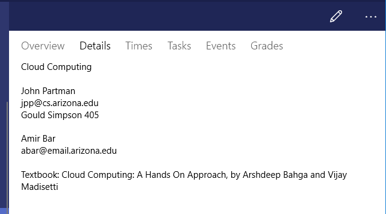
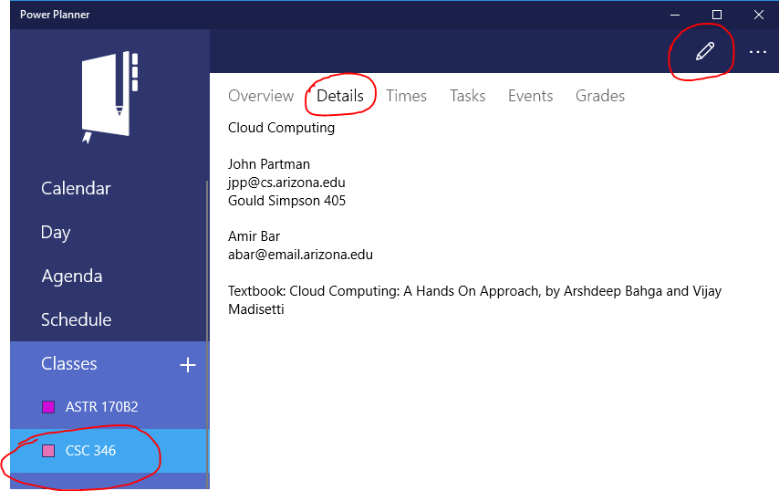

For each class, you can provide free-form details about that class, where you can enter things like...

- Office hours
- Professor email address and phone number
- Teacher Assistants info
- Class website

To add this info, **open your class**, go to the **Details** page, and click the **Edit** icon in the toolbar.

Then, type in whatever details you'd like!