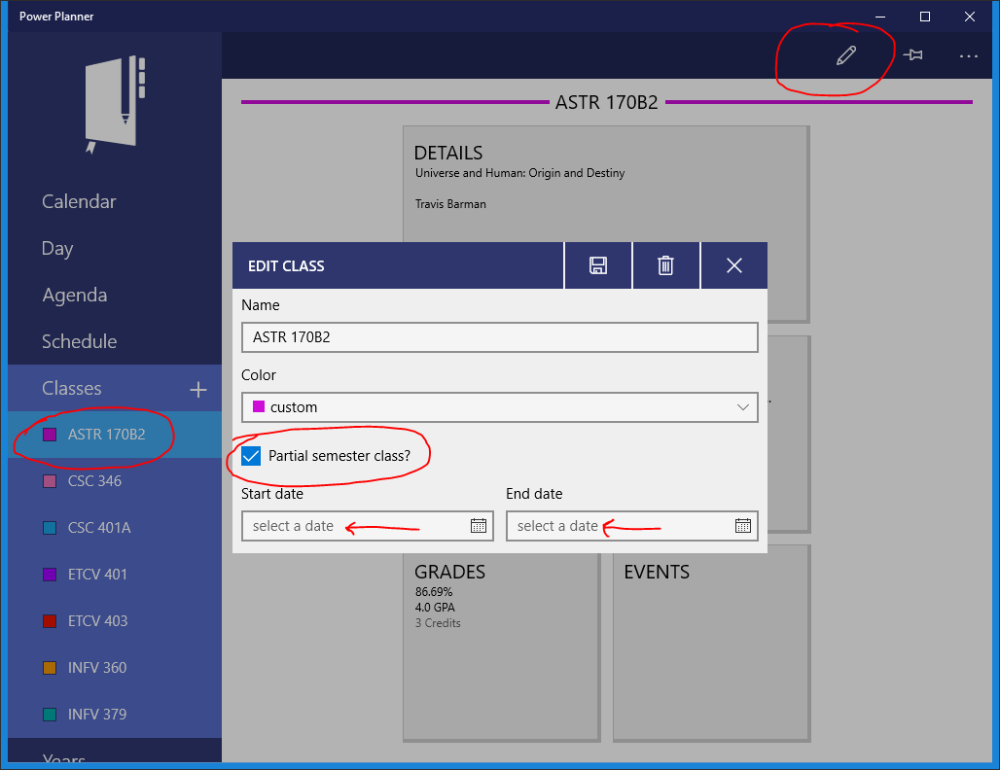

If you have a class that only runs for part of the semester, you can set start and end dates on the class!

Open your class, click the Edit button in the toolbar from the overview page, then select the **Partial semester class? checkbox**. Finally, assign your start and end dates, and remember to click Save when you're done!

