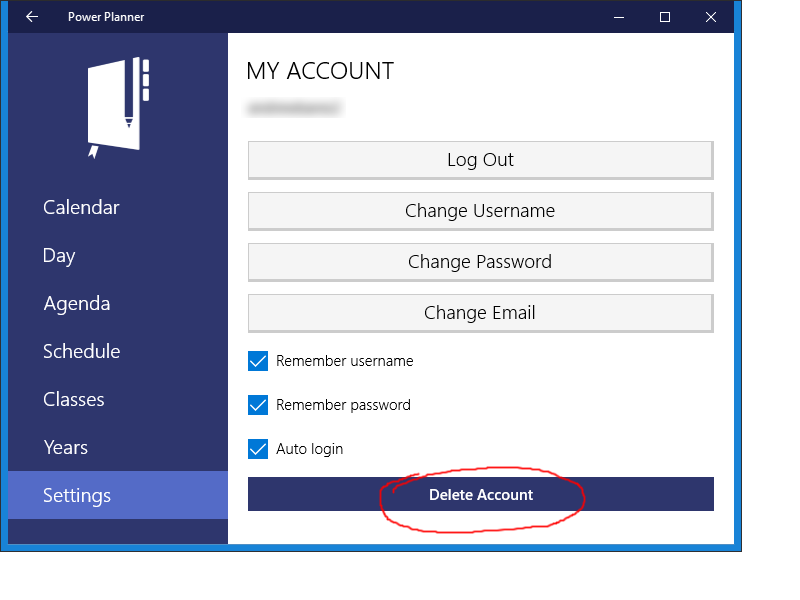
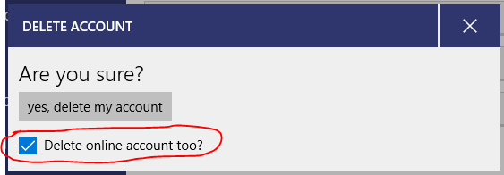

I'm sorry to hear you want to delete your Power Planner account! If there was something you didn't like about Power Planner, please let me know, feedback is appreciated!

**To delete your account**, from any of the apps (iOS, Android, or Windows, but not the website), go to **Settings -> My account**, and click the **Delete Account** button.

You'll be asked to confirm your password before deleting (to ensure that it's actually you deleting your account).

If you want to completely delete your online account, be sure to check the "Delete online account too?" option, and then click yes to continue. **Note that this is NOT reversible**. A deleted account is permanent.

