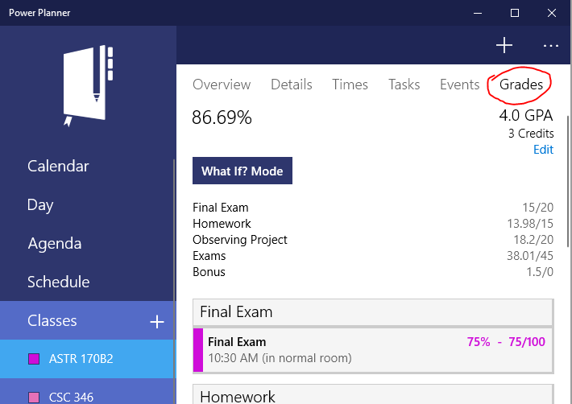
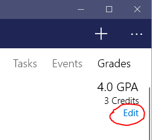
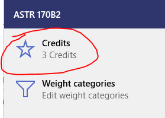
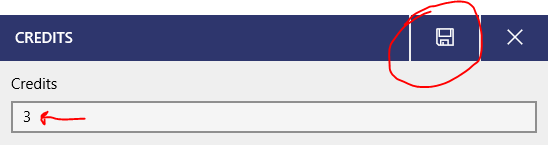

To assign the number of credits your class has, **open your class**, and then go to the **grades** page.

Then, while on the grades page, **click the "Edit" text button** just below the GPA and credits.

Select Credits, enter your number of credits, and click save! Note that you can enter 0 credits for a class that doesn't count towards your GPA at all.

