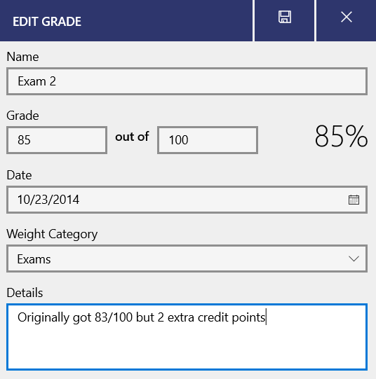
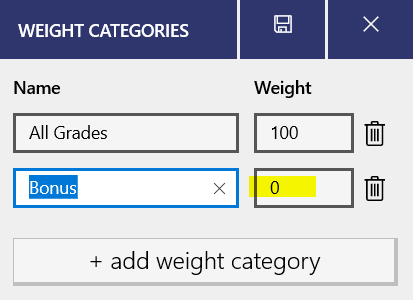
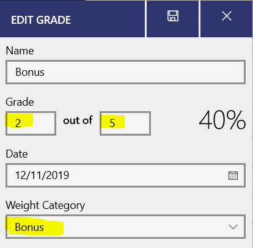
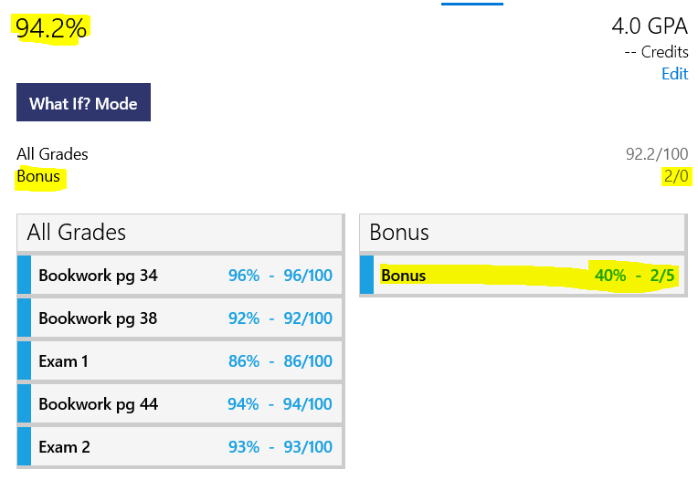
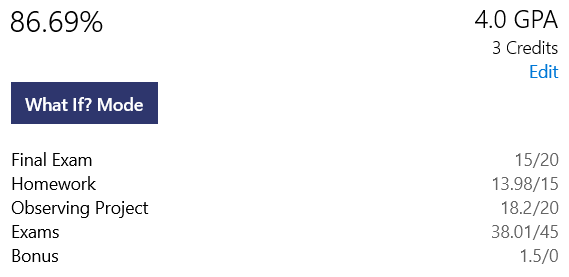
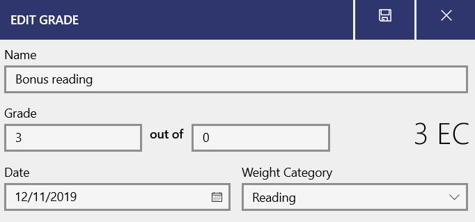
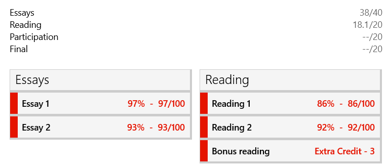

There are a number of varieties of extra credit that teachers give. Power Planner supports a flexible number of options.

## Extra credit on an assignment

If your teacher gave you extra credit on a specific assignment/exam, simply record your final score, and if you want, you can add some details about your original score and how much extra credit you got.

# Extra percentage (%) boost to your final grade

Sometimes teachers give you an opportunity to earn extra percentage points that impact your final grade. For example, if your final grade was 83% in the class, but you received 3 extra percentage points for bonus work, your final grade would then be 86%.

To add this info into Power Planner, you have a few options...

### If you're not using weight categories...

Imagine here's our current grades... we currently have a 92.2% in Math class. But imagine we have the opportunity to receive up to 5 extra percentage points added to our final grade, and we earned 2 of those extra percentage points. Our final grade should actually be 94.2%.

1. Add a weight category called **Bonus**, and **set the weight to 0**. See the [weight categories article](/grades/weighted-grades/) to learn how to add weight categories.

2. Then, **add a grade entry under the Bonus category**, and enter the **amount of bonus points you earned**. You can enter it as a normal grade, like 2/5, and since it's in the Bonus weight category which has a value of 2, only the points you earn will contribute to your final grade. So even though it says 40%, it's not negatively impacting you. Alternatively, you also could enter it as 2/0 if you'd like.

With that added, our grade is now correctly 94.2%!

### If you're already using weight categories...

If the sum of your weight category values adds up to 100 like seen below, simply add a Bonus weight category as described above.

If your weight category values do NOT add up to 100, then you will have to accordingly weight the bonus amount you enter. You can contact me for help on this.

## Extra points

If your teacher gave you an extra credit assignment which simply adds extra points to your weight category (or all grades), you can enter the item as 3 out of 0.

This will sum up as extra point values in the total sum of the category.

