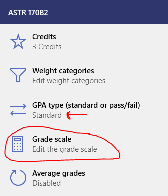
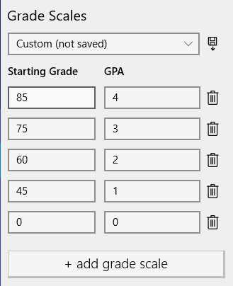
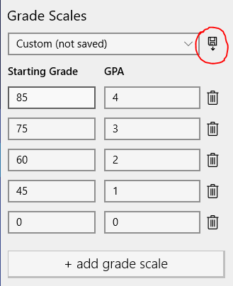
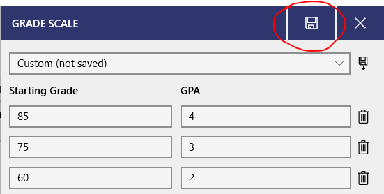

If your class or school uses something different than the 4.0 GPA scale (like a 10.0 scale, or 85% == 4.0, or anything else), Power Planner supports that!

## Change the defaults

You can edit the GPA scale for ALL classes by going to **Settings -> Default grade options**.

## Change the scale for a specific class

To change the grade and GPA scale for a specific class, **open your class**, and then go to the **grades** page.

Then, while on the grades page, **click the "Edit" text button** just below the GPA and credits.

Click the **Grade scale** entry to edit the grade scales. If you don't see it, make sure the **GPA type** is set to "Standard".

Scroll down, and edit the grade/GPA scale as desired.

Optionally, to re-use this grade scale across other classes, click the save button next to the "Custom (not saved)" drop down, and then give it a name and click save.

Finally, **be sure to click save in the top right** once you're done with all your changes to the class grade options!

