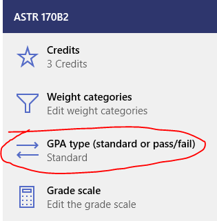
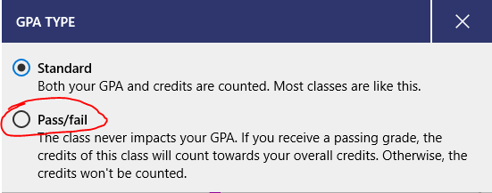

If you have a pass/fail class (where your final grade doesn't matter, but if you pass the class, it counts towards your credits without changing your GPA), you can add those to Power Planner!

To change a class to be pass/fail, **open your class**, and then go to the **grades** page.

Then, while on the grades page, **click the "Edit" text button** just below the GPA and credits.

Select **GPA type** and then change it to **Pass/fail**!

