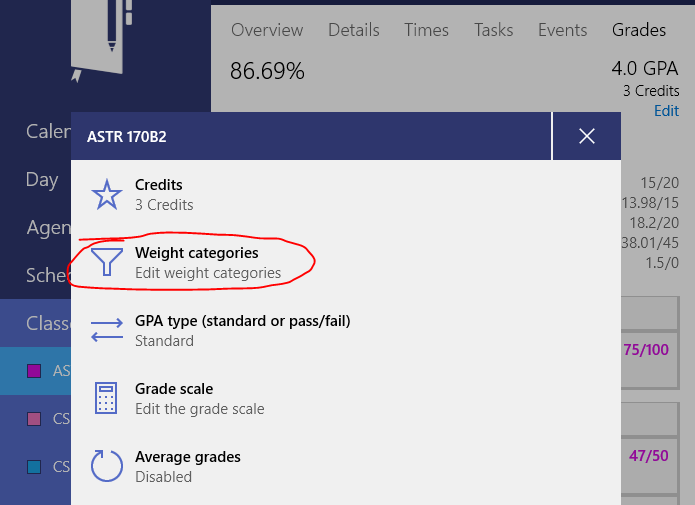
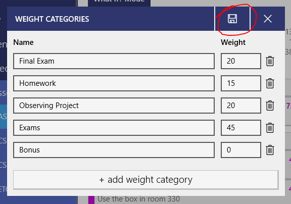

If your class weights grades into categories, like 30% homework, 60% exams, 10% participation, Power Planner supports that!

To edit the weight categories, **open your class**, and then go to the **grades** page.

Then, while on the grades page, **click the "Edit" text button** just below the GPA and credits.

Edit your weight categories as desired! Be sure to **click save when you're done!** Note that the weight categories do not need to add up to 100%... they can add up to 300, or 50, or anything.

