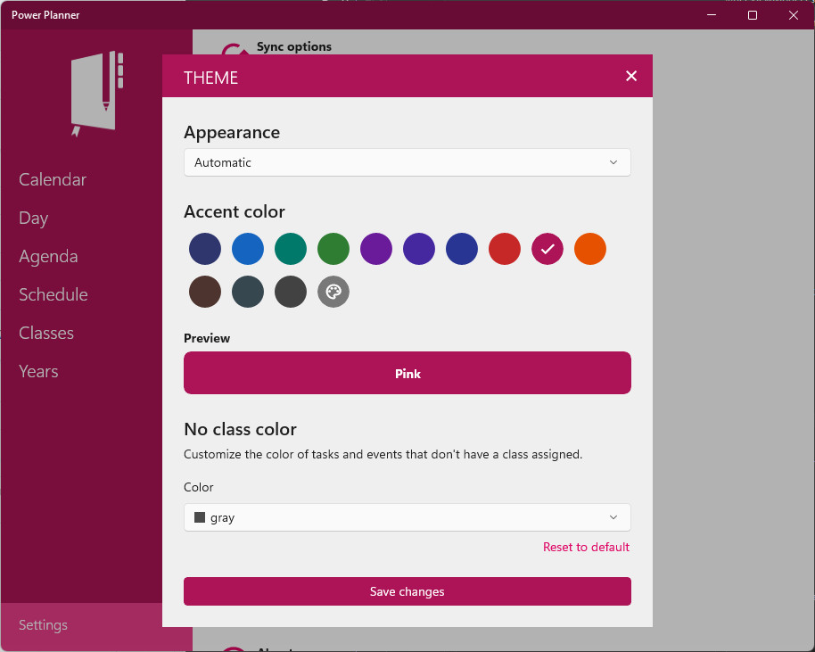

The iOS, Windows, and Android apps support picking a custom theme color for the app. Go to **Settings -> Theme** and you can select a custom accent color that's applied to the colors across the app!

