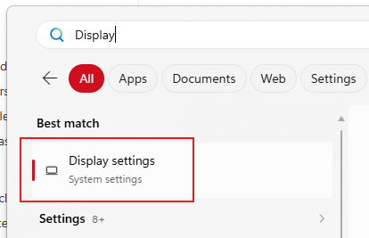
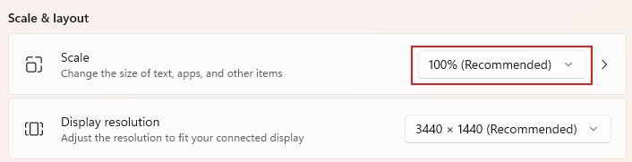

Many Windows computers come from the factory with the text display size set to a very large setting, meaning you can't see much content on your screen!

To change the display size of text, apps, and other items, **open the Start menu** and search for "**Change display settings**"...

Then, scroll down to the "**Scale**" setting that says "Change the size of text, apps, and other items". Try decreasing it by increments of 50%. If it's currently set at 225%, you might want 175% or 150%.

