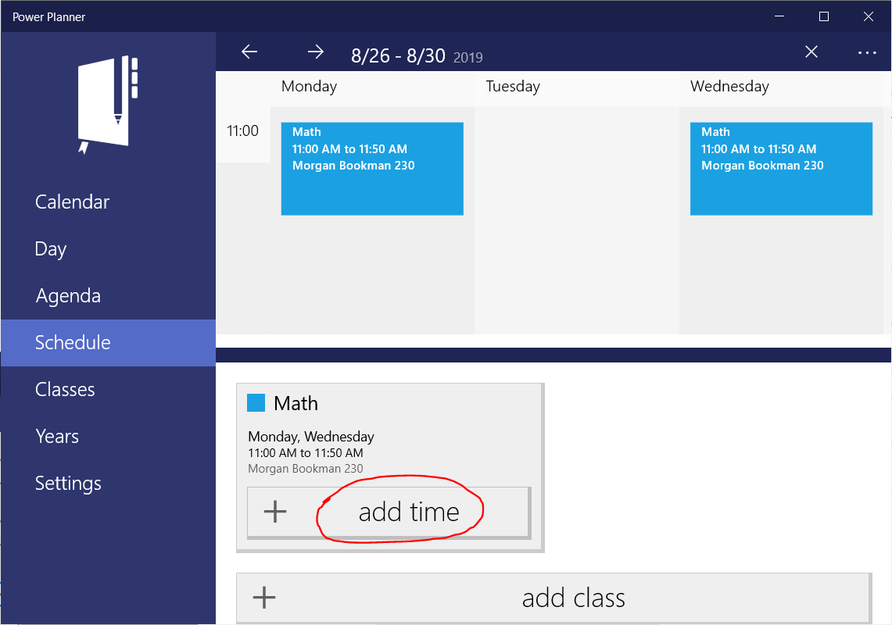
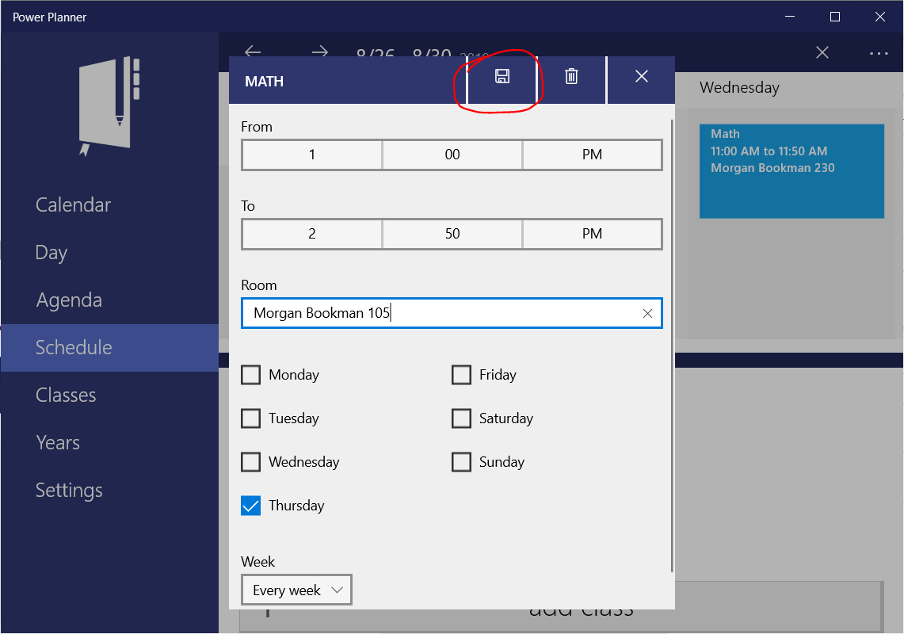
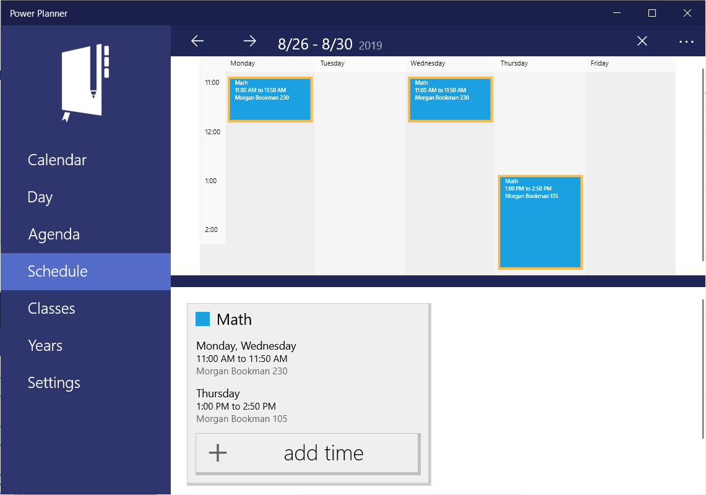

If your class meets at a different time on one of the days of the week, like a lab class period, simply click "+ add time" again for the class to add a different time entry for the class.

Then enter the different time schedule and save your changes!

You now have a class that meets on different times of the week!

