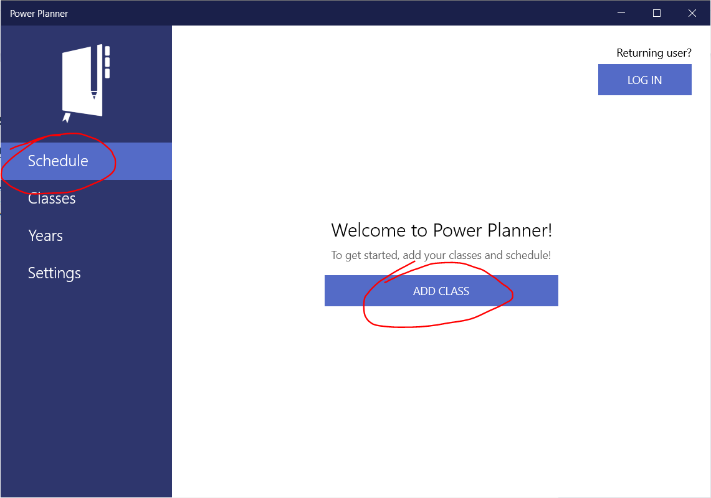
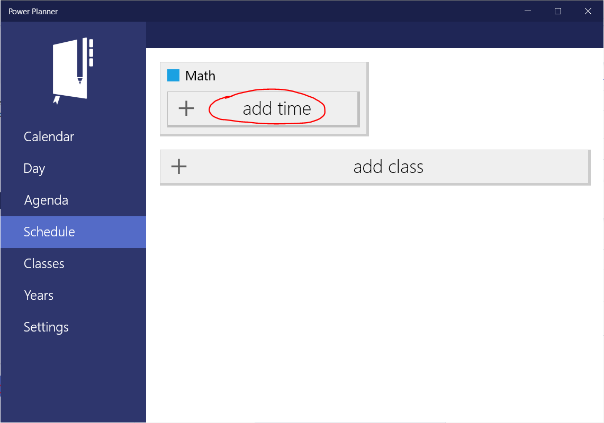
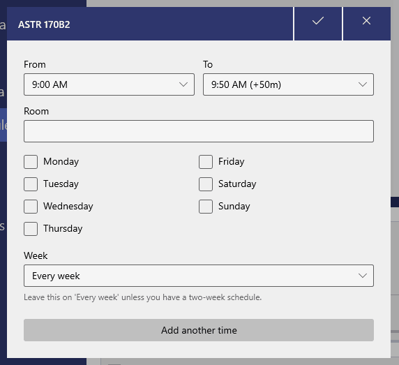

Power Planner supports a flexible schedule system, where each class can occur on multiple days of the week, at multiple different times of the week. For example, you might have a class that has lectures on Monday and Wednesday at 11:00 AM, and labs on Thursdays at 2:00 PM.

## Adding classes

Go to the Schedule page and add your first class.

## Adding schedules / class times

Once you've added a class, you can add times that the class occurs on. Simply click "+ add time", and select the time and days of the week the class occurs on, and enter a room location if desired.

Note that you can type in custom time values like "9:20 AM".

