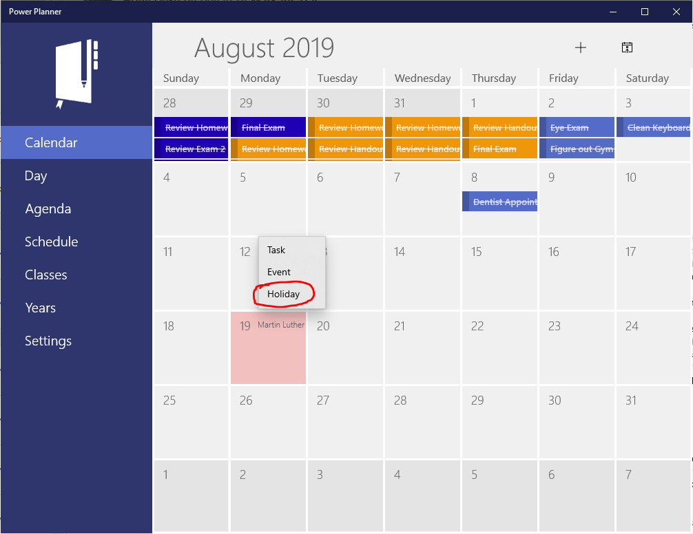
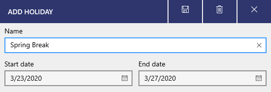
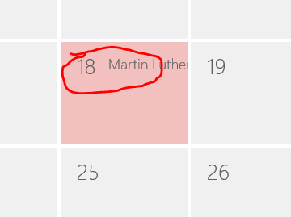
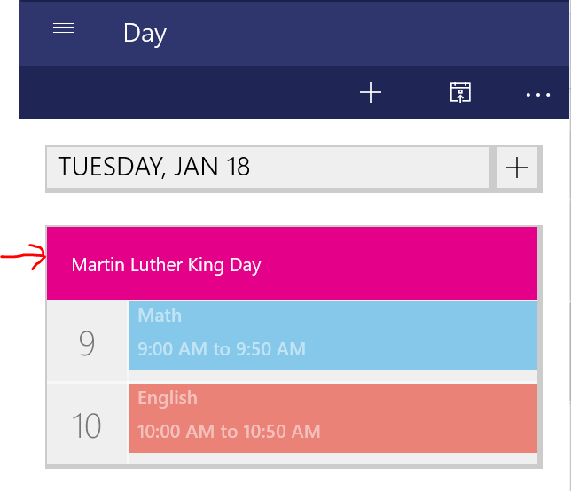
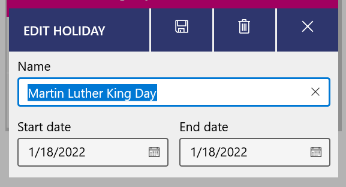

You can add holidays or breaks to your schedule. For example, you can add Spring Break so that your classes don't appear over your break!

To add a holiday, go to the **Calendar** or **Day** views, select the "+" button, and add a **holiday**.

Holidays can be multi-day, with a start and end date.

## Editing holidays

To edit or delete holidays, from the Calendar month view, click the day that has a holiday to open the Day view for that day.

Then, from the Day view, click the holiday itself.

You'll now be able to edit or delete the holiday! (Delete icon is in the upper right).

