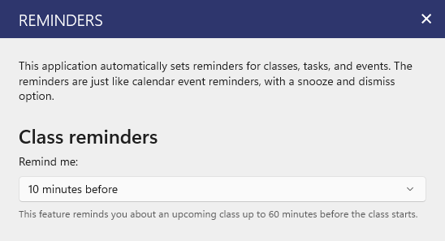

Power Planner will send you automatic reminders for your class schedule. You can configure the reminder to be between 0-60 minutes before your class starts.

The iOS app added support for class reminders in version `2606.8.115` on June 8th, 2026 (the Windows and Android apps have supported class reminders for several years already).
