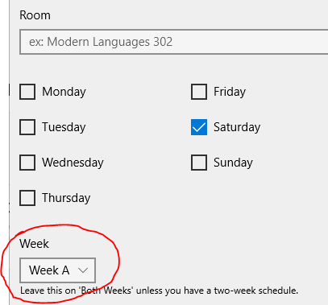
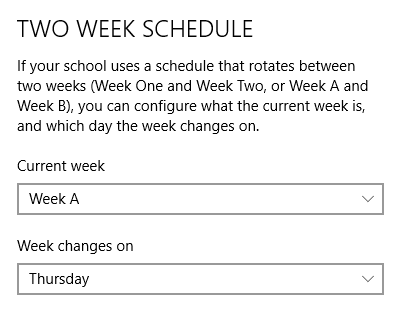

If your school has two different week schedules (an A week or a B week) which switch back and forth each week (otherwise sometimes called block schedules), Power Planner supports that!

When adding or editing a class time, at the bottom, change the Week option to "Week A" or "Week B", depending on which week your class time is supposed to be on.

To **change the current week** or change which day the week switches on, go to **Settings -> Two week schedule**, and change the current week and/or which day the week changes.

