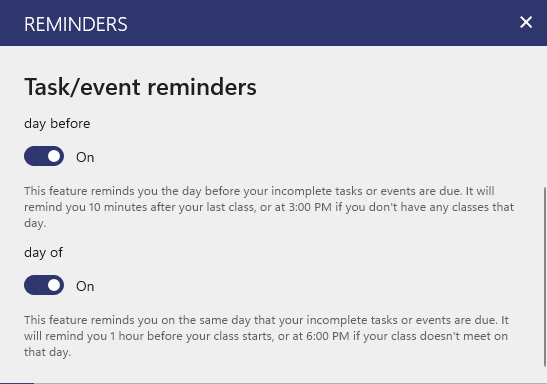

Power Planner will send automatic reminders for tasks and events.

The **day before** reminder tells you what incomplete tasks and events are due tomorrow. It will be sent 10 minutes after your last class, or at 3 PM if you didn't have a class that day.

The **day of** reminder notifies you an hour before an incomplete task or event is due.

Both of these can be disabled in the settings. They are enabled by default.

