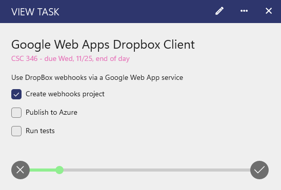
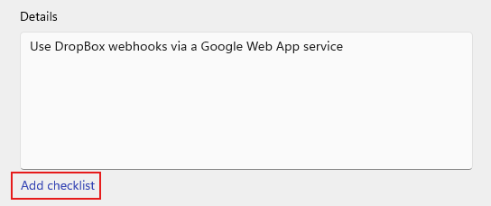
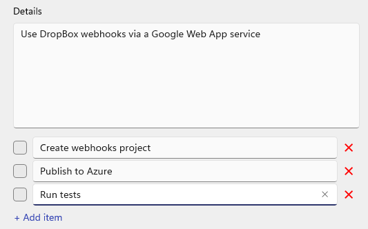

On each task or event, you can add a checklist, similar to sub-tasks, so you can have multiple items you need to complete on a task or event! This is available in version 2605.11 or greater of Power Planner on iOS, Android, and Windows.

When adding or editing a task or exam, click the "Add checklist" text button below the Details text box.

Then, you can add as many items as you want. You can press enter on any item to add another item underneath it, or click "Add item" at the bottom to add to the very bottom. Click the "X" buttons to delete an item.

