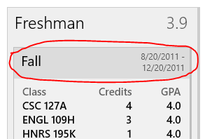
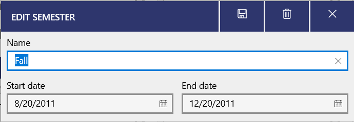

To edit or delete a year or semester, go to the Years page and then click on the name of the year or semester you want to edit or delete.

To find the Years page, on mobile, open the bottom right tab and select View years/semesters. On Windows, use the side menu.

Then, click the title of the year or semester that you want to edit or delete.

Then you can edit the semester or year however you'd like! To delete the semester/year, click the delete icon in the top right (on some platforms, this might be hidden in the "..." menu).

