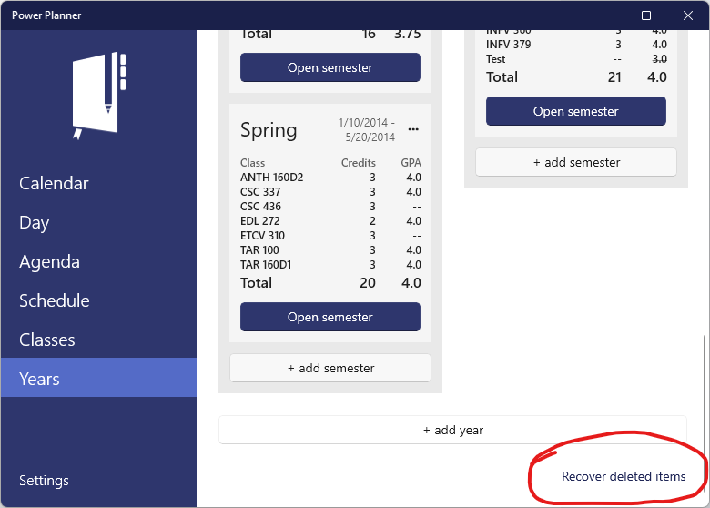
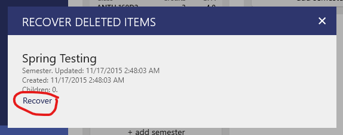

Did you accidentally delete a year or semester? **If you had an online account**, you can restore your deleted year or semester from your online backup.

While connected to the internet, from the Windows, Android, or iOS app (not supported on web app), go to the Years page, scroll down to the bottom, and click the "Recover deleted items" button on the bottom right.

Then, you'll see the list of deleted years and semesters. Click Recover on the one you want to recover.

Recovering will recover everything that was present at the time you deleted it. For example, if a year had two semesters under it when you deleted it, those two semesters will be restored, and all of the classes, tasks, and everything else under those semesters that were previously there will be restored too.